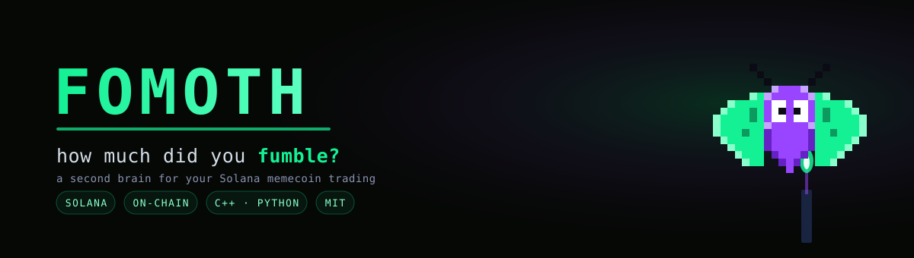
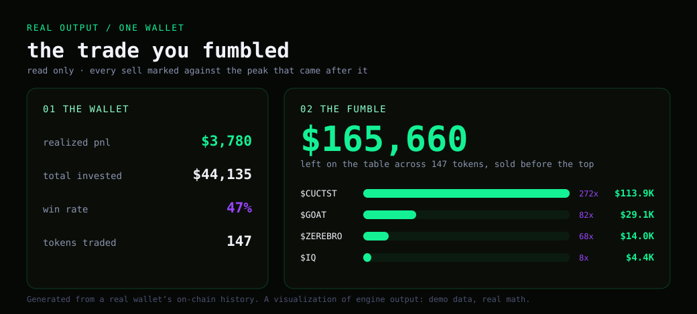
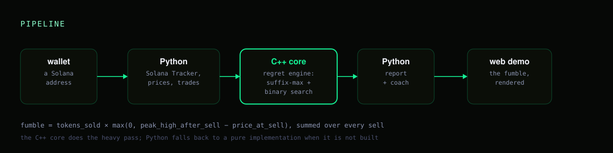

<div align="center">



# FOMOTH

**A second brain for your Solana memecoin trading. Paste a wallet, see what you fumbled.**


[](https://github.com/Denis101Ka/fomoth/actions/workflows/ci.yml)
[](LICENSE)


[Quick start](#quick-start) · [Demo](#demo) · [Architecture](#architecture) · [Roadmap](#roadmap)

</div>

Every tracker shows you dry PnL for taxes. FOMOTH computes the number nobody else does: how much
you left on the table by selling before the top. It reads your trades off the chain, marks every
sell against the peak that came after it, grades the habits that cost you, and coaches you from
your own history with worked, per-token examples.

**Try it in 30 seconds.** The engine and its tests build and run locally with no wallet, no key
and no network.

> [!NOTE]
> FOMOTH reads a **public** wallet address, never a private key, and never signs or sends anything.
> The screenshots below use one real wallet's on-chain history to show the output shape; the math
> is documented in the source, not hidden.

## What it computes

- **The regret engine.** For every sell, the highest price the token reached afterward, valued and
  summed into the dollars you left on the table, plus the peak multiple you missed.
- **Coach metrics.** Expectancy, payoff, win rate and the median hold times, from your own trades.
- **Worked plays.** Concrete, per-token advice: the price you sold at, where it went, and the exact
  dollars a specific rule (a trailing stop, a hard stop) would have saved on that exact trade.

## Demo

<div align="center">

</div>

*A visualization of engine output on one real wallet. Demo data, real math.* The `fumble` CLI takes
a wallet's sells and daily candles on stdin and prints the same numbers as JSON:

```bash
printf '1\nTKN 3 2\n0 2 1\n86400 10 3\n172800 5 4\n0 100\n172800 50\n' | ./build/core/fumble
# {"total_fumble":950,"priced":1,"tokens":[{"mint":"TKN","sold_tokens":150,"fumble_usd":950,"peak_mult":1.25,...}]}
```

## Architecture

<div align="center">

</div>

The compute-heavy pass is **C++**; the data, orchestration and the web layer are **Python**. The two
talk over a tiny process boundary, and the Python side falls back to a pure implementation when the
native core is not built, so the project works with or without a compiler.

- **`core/` — C++17 engine.** The regret engine (`regret.cpp`) values every sell against the peak
  that came after it, computed with a suffix-max over the daily highs and a binary search per sell
  so it stays fast over a full trade history. `coach.cpp` derives the aggregate metrics. Shipped as
  a static library, the `fumble` CLI and its own unit tests.
- **`fomoth/` — Python package.** Solana Tracker client, price history, trade derivation from
  balance deltas, the report builder, the coach copy and a stdlib-only web server.
- **`fomoth/native.py` — the bridge.** Serialises the inputs, runs `fumble`, parses its JSON, and
  falls back to `fomoth/regret.py` when the binary is absent.

```
fumble = tokens_sold × max(0, peak_high_after_sell − price_at_sell), summed over every sell
```

## Quick start

Building the core needs a C++17 compiler and CMake.

```bash
cmake -S . -B build -DCMAKE_BUILD_TYPE=Release
cmake --build build --parallel
ctest --test-dir build --output-on-failure   # C++ unit tests
```

or just `scripts/build.sh`. The Python layer discovers `build/core/fumble` automatically.

Run a report (needs a free [Solana Tracker](https://www.solanatracker.io/data-api) key):

```bash
python -m fomoth <wallet-address>
SOLANATRACKER_KEY=... python -m fomoth.server 8090   # then open localhost:8090
```

## How it reads a trade

FOMOTH does not decode any DEX. For each transaction it looks at how the balances moved: a memecoin
up and SOL down is a buy, a memecoin down and SOL in is a sell. That one rule works across pump.fun,
Raydium and Jupiter because they all end in the same balance change. The method is in
[`fomoth/trades.py`](fomoth/trades.py), and the maths is documented, not hidden.

## Repository structure

```text
assets/                        banner, architecture diagram, demo panel (SVG)
core/                          C++17 engine: regret + coach, CLI, unit tests, CMake
fomoth/                        Python: reader, prices, trades, report, coach, server, bridge
web/                           demo page (rendered report)
scripts/                       build.sh, run.sh
.github/workflows/ci.yml       builds the core, runs ctest and the Python↔C++ bridge end to end
```

## Roadmap

- [x] Trade derivation from balance deltas (DEX-agnostic)
- [x] C++ regret engine + coach metrics, tested in CI
- [x] Report, coach copy and web demo
- [ ] Habit detector (buying tops, cutting winners, revenge trades, overtrading)
- [ ] In-process bindings (pybind11) to drop the subprocess hop
- [ ] Multi-wallet aggregation

## License

MIT. See [LICENSE](LICENSE).
